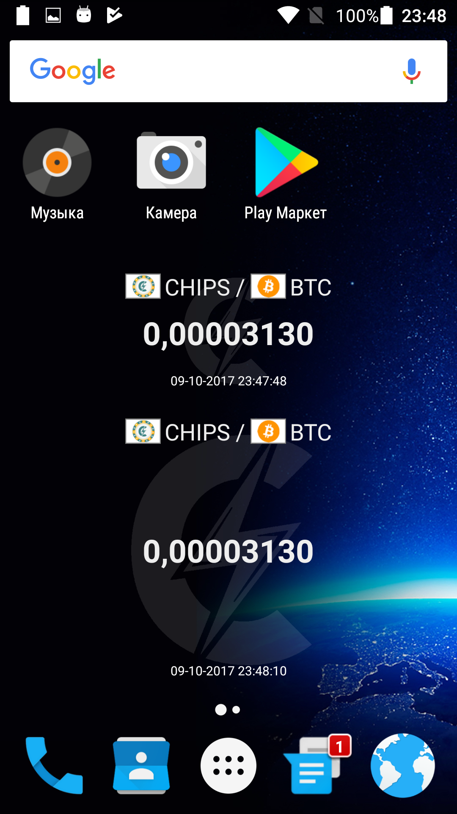

## Android Chips Widget

This is a simple Android widget to display CHIPS coin exchange rate. It takes information from CoinmarketCap API - [https://api.coinmarketcap.com/v1/ticker/chips/?convert=USD](https://api.coinmarketcap.com/v1/ticker/chips/?convert=USD) . This widget can be used as a basement to create more powerful app.

 

